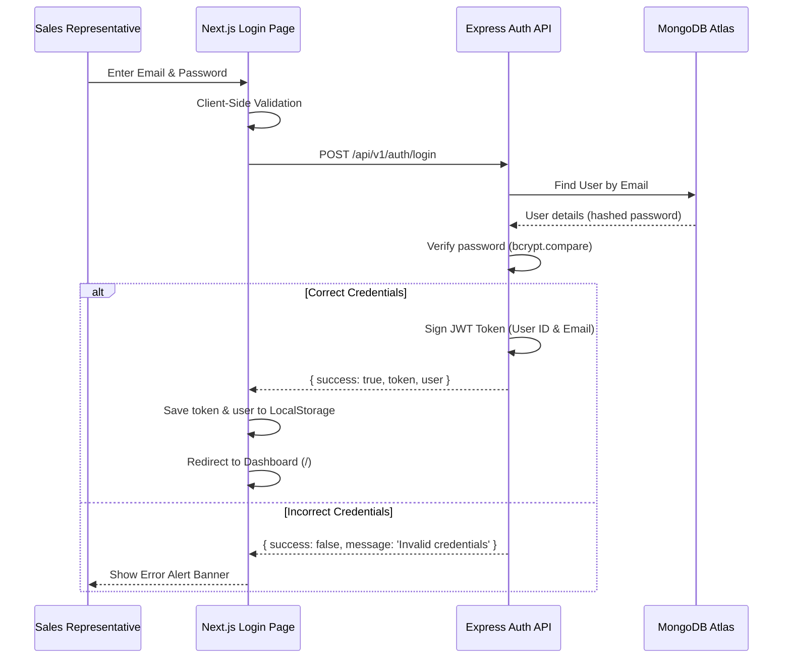

# Mini Leads Tracker - Full Stack MERN CRM System

A production-ready CRM-style Lead Management System designed for sales representatives to track, manage, search, filter, and document customer interaction history.

---

## 🚀 Project Overview

**Mini Leads Tracker** is a streamlined, premium CRM application built using the MERN stack (Next.js, Express, MongoDB, Node.js). The app allows sales reps to log in securely, view an administrative pipeline dashboard, review total and status-based statistics, create and edit leads, search/filter lead databases, and log communication notes under individual customer timelines.

This application is built using clean, modular architecture, features centralized server-side validations and error handling, and utilizes responsive, modern SaaS design aesthetics using pure Tailwind CSS.

---

## ✨ Features

- **JWT Authentication**: Secure login flow using custom middleware, with token persistence in `localStorage`.
- **Pipeline Statistics Dashboard**: Instant count cards detailing Total Leads, New, Contacted, Interested, Converted, and Lost.
- **Lead CRUD Operations**: Create, read, update, and delete lead files with confirmation safety dialogs.
- **Search & Filtering**: Real-time debounce searching (by name and phone) and status filter chips.
- **Activity & Note History**: Sub-document note timeline for logged customer follow-ups and activity feeds.
- **Centralized Validation**: Robust input constraint checkers (min/max lengths, exact 10-digit phone regex) mapping to meaningful error blocks.
- **Centralized Error Handling**: Standardized success/error JSON formats across all endpoint routers.
- **Responsive SaaS Design**: Elegant interface (orange accent, clean cards, soft shadows) adapting to Desktop, Tablet, and Mobile.

---

## 🛠️ Tech Stack

### Frontend
- **Framework**: Next.js 16 (App Router)
- **Styling**: Tailwind CSS v4
- **Language**: JavaScript (CommonJS/ES6, NO TypeScript)
- **HTTP Clients**: Native Fetch API (NO Axios)
- **Authentication**: JWT stored in `localStorage`

### Backend
- **Platform**: Node.js & Express.js
- **Database**: MongoDB & Mongoose
- **Security**: JWT (`jsonwebtoken`) & `bcryptjs`
- **Request Validator**: `express-validator`

---

## 📁 Folder Structure

```text
miniLidsTracker/
├── backend/
│   ├── src/
│   │   ├── config/          # Database configuration (db.js)
│   │   ├── constants/       # Allowed lead statuses (leadStatus.js)
│   │   ├── controllers/     # Controller logic (auth & lead controllers)
│   │   ├── middlewares/     # JWT authentication & validator formatting
│   │   ├── models/          # Mongoose Schemas (User & Lead)
│   │   ├── routes/          # Express route bindings (auth & lead routes)
│   │   ├── validators/      # Validation check schemas
│   │   ├── utils/           # ApiResponse & asyncHandler wrappers
│   │   └── tests/           # Integration API test suite (api.test.js)
│   ├── .env                 # Local environment config (git-ignored)
│   ├── .env.example         # Template for environment variables
│   ├── .gitignore           # Git ignore file for backend files
│   ├── package.json         # Backend dependencies & npm run script bindings
│   ├── app.js               # Express application initializations
│   └── server.js            # Server connection, seeding, and binding
│
├── frontend/
│   ├── src/
│   │   ├── app/             # App router pages (login, dashboard, lead details)
│   │   │   ├── leads/       # Leads pages
│   │   │   │   └── [id]/    # Dynamic Lead details view
│   │   │   │       └── page.js
│   │   │   ├── login/       # Login page view (page.js)
│   │   │   ├── globals.css  # Tailwind configurations
│   │   │   ├── layout.js    # Base HTML template and providers wrapper
│   │   │   └── page.js      # Main CRM Dashboard Page
│   │   ├── components/      # Reusable visual components (Navbar, Cards, Modals)
│   │   ├── context/         # AuthContext authentication hooks
│   │   └── utils/           # Fetch wrapper and authorization handlers
│   ├── .env                 # Local environment config (git-ignored)
│   ├── .env.example         # Template for environment variables
│   ├── .gitignore           # Git ignore file for frontend files
│   └── package.json         # Frontend dependencies & Next.js build runners
│
└── .gitignore               # Workspace-level git ignore rules
```

---

## ⚙️ Environment Variables

### Backend (`backend/.env`)
Create a `.env` file in the `backend/` directory using the template below:
```ini
PORT=5000
MONGODB_URI=mongodb://127.0.0.1:27017/dataDock
JWT_SECRET=your_jwt_secret_key_here
CORS_ORIGIN=http://localhost:3000
NODE_ENV=development
```

### Frontend (`frontend/.env`)
Create a `.env` file in the `frontend/` directory using the template below:
```ini
NEXT_PUBLIC_API_URL=http://localhost:5000/api/v1
```

---

## 🔧 Installation & Local Setup

### Prerequisite
Ensure [Node.js (v18+)](https://nodejs.org/) and [MongoDB](https://www.mongodb.com/) are installed and running locally.

### Step 1: Clone the Repository
```bash
git clone <repository_url>
cd miniLidsTracker
```

### Step 2: Backend Setup
1. Navigate to the `backend` folder:
   ```bash
   cd backend
   ```
2. Install dependencies:
   ```bash
   npm install
   ```
3. Setup environment variables (refer to `.env.example`).
4. Start the backend dev server:
   ```bash
   npm run dev
   ```
The backend server will run on `http://localhost:5000`. On connection, it will automatically seed the mandatory administrator account:
- **Email**: `admin@fasterq.in`
- **Password**: `admin123`

### Step 3: Frontend Setup
1. In a new terminal window, navigate to the `frontend` folder:
   ```bash
   cd ../frontend
   ```
2. Install dependencies:
   ```bash
   npm install
   ```
3. Setup environment variables (refer to `.env.example`).
4. Start the Next.js dev server:
   ```bash
   npm run dev
   ```
The frontend application will boot on `http://localhost:3000`.

---

## 🧪 Running Integration Tests
To run the automated backend test suite, make sure MongoDB is running, navigate to the `backend` folder, and execute:
```bash
node src/tests/api.test.js
```
The test suite clears the test database collections, seeds the admin credentials, and tests:
- Login security and JWT generation.
- Unauthenticated access prevention (401 errors).
- Server-side validations (length parameters, phone regex).
- Database CRUD actions (creating, updating, paging, query search, notes entry, and deleting leads).

---

## 🔒 Authentication Flow



1. **Login**: User enters credentials. On validation pass, a `POST` request is sent to `/api/v1/auth/login`.
2. **Token Generation**: Upon verification, the backend issues a signed JWT token valid for 7 days.
3. **Storage**: The token is stored in `localStorage` and managed globally by `AuthContext`.
4. **Header Interceptor**: All subsequent calls to Leads API use the `apiFetch` wrapper, attaching `Authorization: Bearer <token>` automatically.
5. **Session Expiry**: If the backend returns a `401 Unauthorized` (expired or invalid token), `apiFetch` catches the error, clears local storage, and redirects to `/login`.

---

## 📖 API Documentation

All REST APIs are versioned under `/api/v1/` and return standardized JSON responses.

### 1. User Authentication

#### **POST** `/api/v1/auth/login`
Authenticates user credentials and issues a bearer token.
- **Authentication Required**: No
- **Request Body**:
  ```json
  {
    "email": "admin@fasterq.in",
    "password": "admin123"
  }
  ```
- **Success Response (200 OK)**:
  ```json
  {
    "success": true,
    "message": "Login successful",
    "data": {
      "token": "eyJhbGciOiJIUzI1NiIsInR5cCI6IkpXVCJ9...",
      "user": {
        "id": "60d21b4667d0d8992b610c85",
        "email": "admin@fasterq.in"
      }
    }
  }
  ```
- **Error Response (401 Unauthorized)**:
  ```json
  {
    "success": false,
    "message": "Invalid email or password",
    "errors": []
  }
  ```

---

### 2. Leads Management

#### **POST** `/api/v1/leads`
Creates a new lead profile in the system database.
- **Authentication Required**: Yes (`Bearer <token>`)
- **Request Body**:
  ```json
  {
    "name": "Rahul Sharma",
    "phone": "9876543210",
    "status": "New"
  }
  ```
- **Success Response (201 Created)**:
  ```json
  {
    "success": true,
    "message": "Lead created successfully",
    "data": {
      "_id": "60d21b4667d0d8992b610c89",
      "name": "Rahul Sharma",
      "phone": "9876543210",
      "status": "New",
      "notes": [],
      "createdAt": "2026-07-15T18:46:00.000Z",
      "updatedAt": "2026-07-15T18:46:00.000Z"
    }
  }
  ```
- **Error Response (400 Bad Request)**:
  ```json
  {
    "success": false,
    "message": "Validation failed",
    "errors": [
      {
        "field": "phone",
        "message": "Phone number must be exactly 10 digits"
      }
    ]
  }
  ```

#### **GET** `/api/v1/leads`
Lists leads with pagination support, status filter, and query-based search.
- **Authentication Required**: Yes (`Bearer <token>`)
- **Query Parameters**:
  - `q` (Optional): Search term matching name or phone.
  - `status` (Optional): Status value filter (`New`, `Contacted`, `Interested`, etc.).
  - `page` (Optional): Page index (Default: `1`).
  - `limit` (Optional): Number of leads per page (Default: `10`).
- **Success Response (200 OK)**:
  ```json
  {
    "success": true,
    "message": "Leads retrieved successfully",
    "data": {
      "leads": [
        {
          "_id": "60d21b4667d0d8992b610c89",
          "name": "Rahul Sharma",
          "phone": "9876543210",
          "status": "New",
          "notes": [],
          "createdAt": "2026-07-15T18:46:00.000Z"
        }
      ],
      "pagination": {
        "total": 1,
        "page": 1,
        "limit": 10,
        "totalPages": 1
      },
      "stats": {
        "total": 12,
        "New": 4,
        "Contacted": 2,
        "Interested": 3,
        "Converted": 2,
        "Lost": 1
      }
    }
  }
  ```

#### **GET** `/api/v1/leads/:id`
Fetches the complete lead file, including its full note chronology.
- **Authentication Required**: Yes (`Bearer <token>`)
- **Success Response (200 OK)**:
  ```json
  {
    "success": true,
    "message": "Lead retrieved successfully",
    "data": {
      "_id": "60d21b4667d0d8992b610c89",
      "name": "Rahul Sharma",
      "phone": "9876543210",
      "status": "New",
      "notes": [
        {
          "_id": "60d21b4667d0d8992b610c9a",
          "text": "Initial welcome call completed.",
          "createdAt": "2026-07-15T18:47:00.000Z"
        }
      ],
      "createdAt": "2026-07-15T18:46:00.000Z",
      "updatedAt": "2026-07-15T18:47:00.000Z"
    }
  }
  ```
- **Error Response (404 Not Found)**:
  ```json
  {
    "success": false,
    "message": "Lead not found",
    "errors": []
  }
  ```

#### **PATCH** `/api/v1/leads/:id`
Updates lead parameters (name, phone, and status).
- **Authentication Required**: Yes (`Bearer <token>`)
- **Request Body** (Supports partial updates):
  ```json
  {
    "status": "Interested"
  }
  ```
- **Success Response (200 OK)**:
  ```json
  {
    "success": true,
    "message": "Lead updated successfully",
    "data": {
      "_id": "60d21b4667d0d8992b610c89",
      "name": "Rahul Sharma",
      "phone": "9876543210",
      "status": "Interested",
      "notes": [],
      "createdAt": "2026-07-15T18:46:00.000Z",
      "updatedAt": "2026-07-15T18:49:00.000Z"
    }
  }
  ```

#### **POST** `/api/v1/leads/:id/notes`
Adds an interaction log to the lead timeline.
- **Authentication Required**: Yes (`Bearer <token>`)
- **Request Body**:
  ```json
  {
    "text": "Customer requested callback tomorrow at 3 PM."
  }
  ```
- **Success Response (200 OK)**:
  ```json
  {
    "success": true,
    "message": "Note added successfully",
    "data": {
      "_id": "60d21b4667d0d8992b610c89",
      "notes": [
        {
          "text": "Customer requested callback tomorrow at 3 PM.",
          "_id": "60d21b4667d0d8992b610c9c",
          "createdAt": "2026-07-15T18:50:00.000Z"
        }
      ]
    }
  }
  ```
- **Error Response (400 Bad Request)**:
  ```json
  {
    "success": false,
    "message": "Validation failed",
    "errors": [
      {
        "field": "text",
        "message": "Note text must be between 2 and 500 characters"
      }
    ]
  }
  ```

#### **DELETE** `/api/v1/leads/:id`
Deletes a lead profile permanently from the database.
- **Authentication Required**: Yes (`Bearer <token>`)
- **Success Response (200 OK)**:
  ```json
  {
    "success": true,
    "message": "Lead deleted successfully",
    "data": {}
  }
  ```

---

## ☁️ Deployment Guide

### Backend Deployment (Render)
1. Go to [Render](https://render.com/) and create a new **Web Service**.
2. Connect your Git repository.
3. Configure settings:
   - **Environment**: `Node`
   - **Build Command**: `npm install`
   - **Start Command**: `npm start`
4. Add **Environment Variables** in Render settings:
   - `MONGODB_URI`: Your MongoDB Atlas URI.
   - `JWT_SECRET`: A secure, secret string.
   - `CORS_ORIGIN`: Your production frontend URL (e.g. `https://your-app.vercel.app`).
   - `NODE_ENV`: `production`

### Frontend Deployment (Vercel)
1. Go to [Vercel](https://vercel.com/) and import your project.
2. Choose `frontend` directory as the project root.
3. Set the framework preset: **Next.js**.
4. Set **Environment Variables** in Vercel settings:
   - `NEXT_PUBLIC_API_URL`: Your deployed Render API root URL (e.g. `https://your-api.onrender.com/api/v1`).
5. Click **Deploy**.

### Database Deployment (MongoDB Atlas)
1. Register at [MongoDB Atlas](https://www.mongodb.com/cloud/atlas).
2. Create a free shared cluster (M0) and copy the connection string.
3. Whitelist access from all IP addresses (`0.0.0.0/0`) or configure specific Render service access.
4. Set up database credentials and configure the connection string in your Render backend `.env` variables.

---

## 🔮 Future Improvements

1. **Multiple User Roles**: Implement granular access permissions (e.g., Administrator, Sales Rep, Viewer).
2. **Audit Logging**: Systematically trace user actions (e.g. tracking who changed a lead status or deleted files).
3. **Advanced Analytics**: Interactive charts showing conversions, lead age, and team performance metrics.
4. **Calendar Integration**: Schedule call events directly in Google Calendar or Outlook.

---

## 📄 License

This project is licensed under the MIT License - see the LICENSE file for details.
